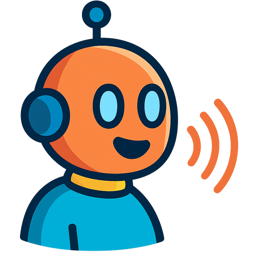

# Voice Chat — browser-based LLM voice assistant

**Voice Chat** is a lightweight JavaScript Progressive Web App that lets you hold a real-time voice conversation with an OpenAI language model.  
It works on desktop and mobile, on any modern OS or browser—no server-side code required.

  

---

## ✨ Features
* 🎙 Hands-free recording with voice-activity detection  
* 📝 On-device Whisper transcription  
* 🤖 ChatGPT (3.5 / 4 / 4o) back-end  
* 🔊 TTS playback with local caching  
* 📱 Installable PWA (Add to Home Screen)  
* 🔒 All data stays in the browser; only outbound calls go to `api.openai.com`  

---

## Requirements
* A microphone (permission will be requested in the browser)  
* An **OpenAI API key** – generate at <https://platform.openai.com/api-keys>  

---

## Installation
1. **Copy** the repository contents to any static web server.  
2. Open `index.html` in your browser (HTTPS recommended).  
3. Paste your OpenAI API key into **Settings**.  
4. Start talking!

> A live demo is hosted at **<https://senssoft.com/chat>** – open it on desktop or mobile, grant mic permission and test immediately.

## Buy me a coffee
If you liked this project, you can buy me a coffee or send a few bucks to support it—links are on the right side of the page.

